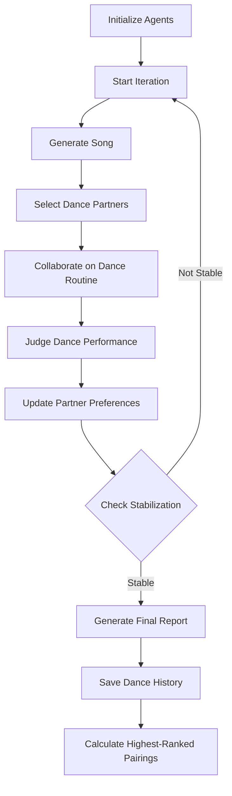
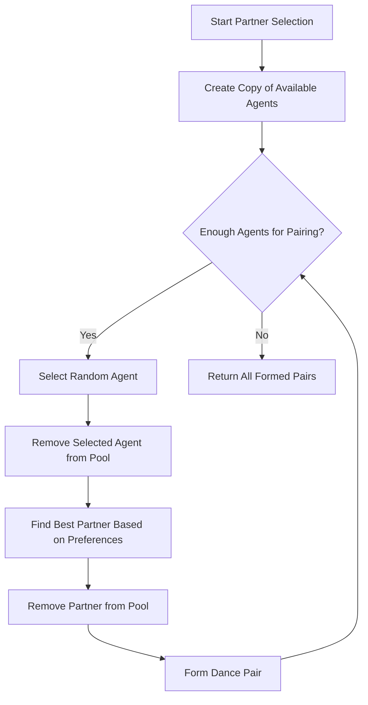

### **LLMDISCO EVALUATION FRAMEWORK**

The script simulates a dance competition involving multiple agents who collaborate, perform, and are judged on their dance routines. Each agent has preferences and interacts with others to form dance pairs. The simulation iterates through multiple rounds until the partner selection stabilizes, and then it generates reports on the best-performing pairs and routines.

### **Output:**
The script generates logs, a final report (`final_report.txt`), and a markdown file (`dance_history.md`) containing detailed results of the simulation, including dance pairings, routines, and rankings.

main flow

partner selection flow

### **Key Components:**

1. **Imports and Setup:**
   - The script imports various modules including `asyncio` for asynchronous programming, `random` for random selections, `json` for JSON handling, and `logging` for logging events.
   - The `openai` library is imported to interact with language models asynchronously.

2. **Logging Configuration:**
   - Logging is configured to record events in a file named `disco_simulation.log`.

3. **Agent and DancePair Classes:**
   - **Agent:** Represents a dance participant, with attributes like `id`, `preferred_style`, `model`, and `partner_preferences`.
   - **DancePair:** Represents a pair of agents who will dance together.
   - **DanceResult:** Stores the results of a dance including the routine, score, feedback, and the song.

4. **MultiAgentDisco Class:**
   - **Initialization:** Initializes agents with random dance styles and models, and sets up iterations and stabilization criteria.
   - **generate_song:** Asynchronously generates a song description using a language model, considering attributes like title, genre, tempo, mood, and description.
   - **select_partners:** Pairs agents based on their preferences.
   - **collaborate_on_dance:** Agents collaborate asynchronously to create a dance routine. The routine is built up through a series of moves generated by a language model.
   - **judge_dance:** Judges the dance routine using a language model, providing a score and feedback.
   - **update_preferences:** Updates agent preferences based on dance performance scores.
   - **run:** The main loop where the simulation runs through several iterations of pairing agents, generating dance routines, and scoring them. The loop checks for stabilization of partner selections.
   - **generate_final_report and save_dance_history:** These methods generate a report of the final results and save the dance history and rankings.

5. **Asynchronous Operation:**
   - The script uses asynchronous functions (`async def`) and `await` to handle potentially long-running tasks like generating responses from language models without blocking the main execution flow.

6. **Main Function:**
   - The `main()` function initializes the `MultiAgentDisco` framework and starts the simulation by calling `framework.run()`.
